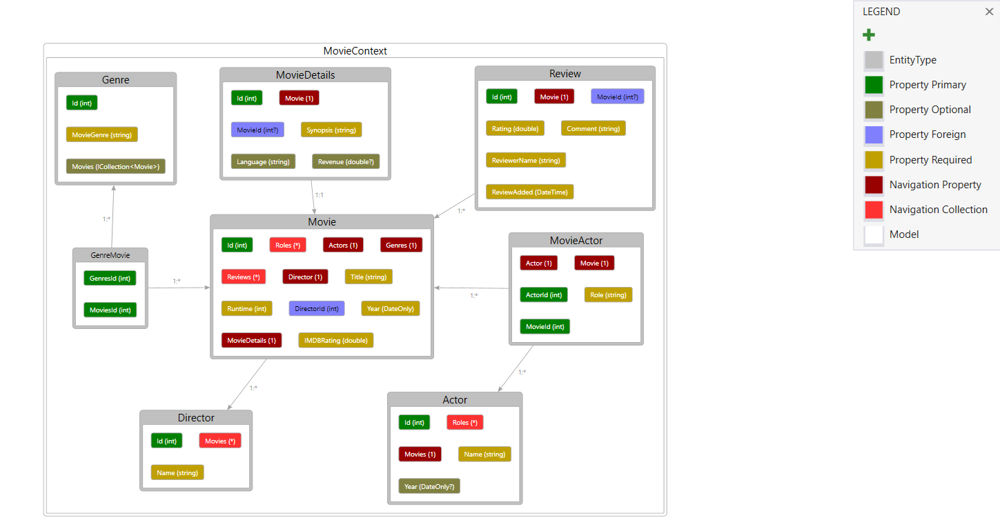
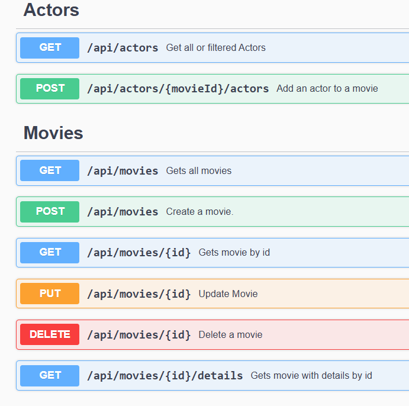

## Movie API – Entity Framework & APIs
### Introduction

This project is a hands-on assignment focused on working with Entity Framework Core, exploring database relationships, and exposing functionality through a well-structured Web API using ASP.NET Core. 

The project also makes use of Swagger for interactive API documentation and testing.

The application is centered around a movie database with entities such as Movies, Directors, Actors, Reviews, and Genres. 

The goal is to implement realistic functionality such as:

- Adding and retrieving records

- Handling relationships (e.g., assigning actors to movies with specific roles)

- Filtering and querying based on user input

- Generating reports (e.g., most prolific actors, top genres by IMDb rating)

- Validating user input with Data Annotations

- Providing informative responses using proper HTTP status codes

## Data & Structure
The original dataset from PromptCloud is publicly available and can be accessed [here](https://www.kaggle.com/datasets/PromptCloudHQ/imdb-data)

You can refer to the Entity Relationship Diagram (ERD) for a clear overview of the database structure and entity relationships.

Example screenshots from Swagger UI are provided to showcase the API usage and test endpoints.

Technologies Used

- ASP.NET Core Web API (.NET 8)
- Entity Framework Core
- SQL Server 
- Swagger / Postman for API testing
- Fluent validation & Data Annotations for DTOs
- LINQ for data querying and projection
